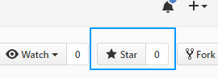
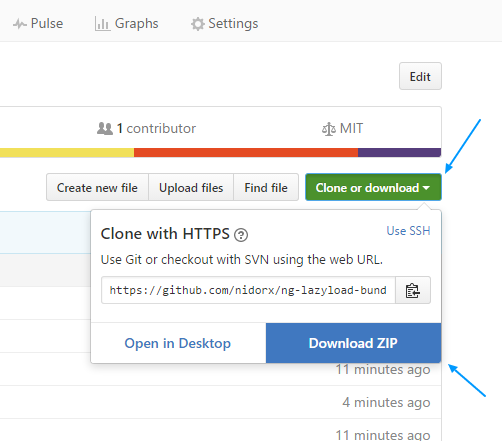
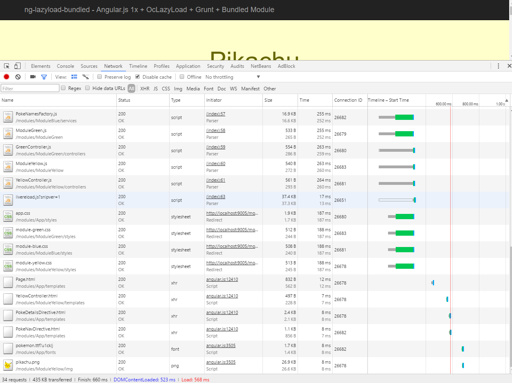
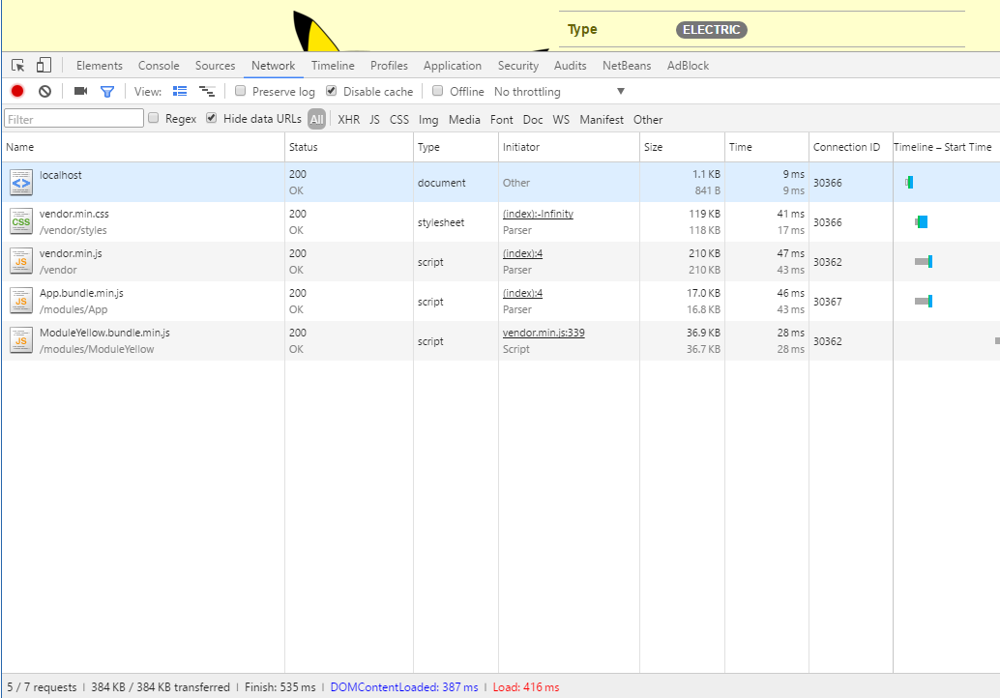
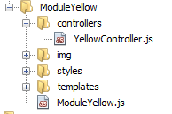

# ng-lazyload-bundled

> Angular.js 1x + OcLazyLoad + Grunt + Bundled Module


Este é um modelo de organização das tarefas do grunt para facilitar o desenvolvimento
de projetos que fazem uso do Angular 1.x.

Este template vem para auxiliar o público da ferramenta na construção de uma aplicação rápida, robusta e adaptável.

Entre as vantagens desse template estão:

* Desenvolvimento modular
* Empacotamento de módulos (scripts, estilos, imagens e webfonts) (ao estilo [webpack](https://webpack.github.io))
* Carregamento Assíncrono (Lazy loading) de módulos
* Desenvolvimento ágil
    - Sass
    - Atualização automática da pagina quando há alteração em arquivos (watch, livereload)
    - Inclusão automática de scripts e styles durante o desenvolvimento


Sinta-se livre para baixar e modificar essa arquitetura de acordo com a sua necessidade.

<div align="center">
    
</div>

## Primeiros passos

Faça a instalação das ferramentas de trabalho:

1. [Node.js](https://nodejs.org/en/download)
2. [Git](https://git-scm.com/downloads)
3. [Cmder](http://cmder.net) — Apenas para usuários Windows
4. [Bower](https://bower.io) — No terminal: `npm install -g bower`
5. [Grunt CLI](http://gruntjs.com) — No terminal: `npm install -g grunt-cli`


Executando o projeto:

1. Adicione este projeto aos favoritos.
    - 
2. Faça o download ou clone este repositorio com o git — `git clone https://github.com/nidorx/ng-lazyload-bundled.git`.
    - 
3. No terminal, instalar as dependencias `npm install` e `bower install`
3. No terminal, executar o projeto `grunt server`

## Tarefas disponíveis

### server (default)

Usado durante o processo de desenvolvimento.

Faz a compilação dos arquivos de estilo (sass), inicia o servidor local e passa a ouvir as alterações no codigo fonte,
atualizando a página no navegador.

No terminal: `grunt` ou `grunt server`.


### dist

Usado para gerar os pacotes de distribuição

Faz a compilação dos arquivos de estilo (sass), empacotamento dos módulos, concatena as dependencias de fornecedores
e copia os recursos para o diretório de distribuição (dist).

Ao final do processo, os arquivos do diretório `dist` devem ser usados para publicar a aplicação.

No terminal: `grunt dist`.


### dist-server

Permite executar um servidor utilizando os pacotes de distribuição.

No terminal: `grunt dist-server`.

### clean

Permite limpar o diretório de distribuição. Execute sempre antes de gerar o pacote de distribuição.

No terminal: `grunt clean`.


## Contribuindo

Contribuições são bem vindas.

* Faça um **pull-request** contendo correção de erros, adição de novas funcionalidades ou melhoria na documentação.
* [Proponha](https://github.com/nidorx/ng-lazyload-bundled/issues) novas funcionalidades e melhorias.
* [Reporte erros](https://github.com/nidorx/ng-lazyload-bundled/issues) encontrados no template.


## Perguntas frequentes


### O Lazy Loading não está funcionando, está sempre carregando todos os arquivos!!



O **resolvedor de dependencias** (ver `function resolveModule(module)` em `src/modules/App/routes/Routes.js`) valida a existencia da flag global `window.__BUNDLED__MODULES__` para decidir se faz ou não o carregamento dinâmico.

Quando você está desenvolvendo (tarefa `grunt server` ou apenas `grunt`) todos os arquivos de todos os módulos são carregados, esse é o comportamento esperado.

Já quando voce gera os pacotes de distribuição (tarefa `grunt dist`), essa flag é adicionada nos arquivos, fazendo com que o **resolvedor de dependencias** decida por baixar a dependencia.

Para testar o comportamento do Lazy Load, execute no terminal `grunt dist-server`.

Perceba que agora foi carregado somente os pacotes necessários, os módulos serão carregados de forma assíncrona, conforme solicitados.




### Durante o desenvolvimento, como eu adiciono novos módulos?

Não é necessário nenhuma configuração extra, basta criar o diretório do novo módulo, adicionar os arquivos do módulo (js, scss) e eles serão adicionados no arquivo `index.html` usado pelo servidor (`dist/index.html`).

O arquivo original (`src/index.html`) permanece inalterado.


### Qual é a ordem de concatenação dos arquivos existentes no módulo?

Os arquivos são invocados/concatenados no formato `top-down`.

Os arquivos dos diretórios mais externos são adicionados primeiro, e na sequencia os arquivos dos diretórios internos.

**Exemplo:**  Para o módulo abaixo, os arquivos .js serão invocados (e concatenados na versão de distribuição) na seguinte ordem.

```
ModuleYellow.js
YellowController.js
```




### Como alterar o diretório do codigo fonte? E o diretório de distribuição?

Basta alterar as propriedades abaixo que estão no arquivo `Gruntfile.js`.

```
grunt.config.set('srcDir', 'src');
grunt.config.set('mdlDir', 'modules');
grunt.config.set('distDir', 'dist');
```

Ex. Para gerar os pacotes de distribuição no diretório `saida`, basta definir `grunt.config.set('distDir', 'saida');`.


### Todos os arquivos de mídia (imagem, webfont) são transformados em [Base64](https://pt.wikipedia.org/wiki/Base64) e incluídos no pacote final?

Não, somente mídias apontadas nos arquivos `.scss` que satisfaçam a configuração do plugin
[grunt-css-url-embed](https://github.com/mihhail-lapushkin/grunt-css-url-embed).

Você pode alterar essa configuração pelo arquivo `grunt/cssUrlEmbed.js`.

Por padrão, apenas arquivos de mídia inferior a `100 KB` serão substituídos.


### Algum script do pacote de distribuição quebrou a aplicação, como eu consigo depurar?

Os arquivos do diretório de distribuição são minificados.

Para alterar esse comportamento, altere o valor da variável `UGLIFY_BUNDLE` no arquivo `grunt/misc/pack-modules.js` para  `false`.
Deste modo, os arquivos de distribuição serão gerados apenas **concatenados** sem compactação, permitindo a depuração do script defeituoso.


## Licença

O código está disponível sob a [licença MIT](LICENSE).

